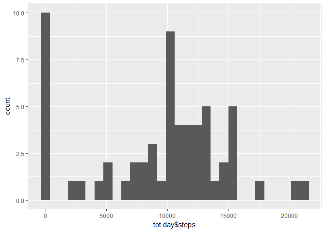
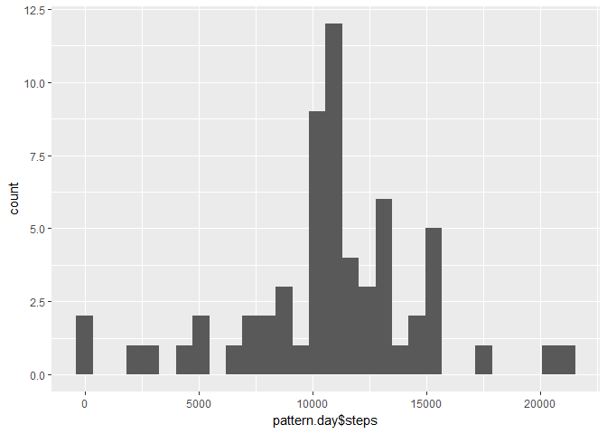

# Reproducible Research: Peer Assessment 1


```r
library(ggplot2)
library(dplyr)
```

```
## 
## Attaching package: 'dplyr'
```

```
## The following objects are masked from 'package:stats':
## 
##     filter, lag
```

```
## The following objects are masked from 'package:base':
## 
##     intersect, setdiff, setequal, union
```

```r
# library(Hmisc)
```

## Loading and preprocessing the data

1. Code for reading in the dataset and/or processing the data

```r
fig.path='C:\\Users\\kurer\\Documents\\Kurse\\Coursera\\Kurs\\ReproducibleResearch\\Week2\\RepData_PeerAssessment1-master\\RepData_PeerAssessment1-master\\instructions_fig'
if(!file.exists("activity.csv")){
  unzip("activity.zip")
}
dat.roh <- read.csv("activity.csv")
str(dat.roh)
```

```
## 'data.frame':	17568 obs. of  3 variables:
##  $ steps   : int  NA NA NA NA NA NA NA NA NA NA ...
##  $ date    : Factor w/ 61 levels "2012-10-01","2012-10-02",..: 1 1 1 1 1 1 1 1 1 1 ...
##  $ interval: int  0 5 10 15 20 25 30 35 40 45 ...
```

```r
summary(dat.roh)
```

```
##      steps                date          interval     
##  Min.   :  0.00   2012-10-01:  288   Min.   :   0.0  
##  1st Qu.:  0.00   2012-10-02:  288   1st Qu.: 588.8  
##  Median :  0.00   2012-10-03:  288   Median :1177.5  
##  Mean   : 37.38   2012-10-04:  288   Mean   :1177.5  
##  3rd Qu.: 12.00   2012-10-05:  288   3rd Qu.:1766.2  
##  Max.   :806.00   2012-10-06:  288   Max.   :2355.0  
##  NA's   :2304     (Other)   :15840
```


## What is mean total number of steps taken per day?

```r
tot.day <-
  dat.roh%>%
  group_by(date)%>%
  summarize(steps=sum(steps,na.rm=TRUE))
```

2. Histogram of the total number of steps taken each day

```r
ggplot(data=tot.day, aes(tot.day$steps)) + geom_histogram()
```

```
## `stat_bin()` using `bins = 30`. Pick better value with `binwidth`.
```

<!-- -->

3. Mean and median number of steps taken each day

```r
mean <- mean(tot.day$steps)
median <- median(tot.day$steps)
```
- Mean: 9354.2295082
- Median: 10395


## What is the average daily activity pattern?

```r
pattern.int <-
  dat.roh%>%
  group_by(interval)%>%
  summarize(steps=mean(steps,na.rm=TRUE))
```

4. Time series plot of the average number of steps taken

```r
ggplot(data=pattern.int, aes(x=interval,y=steps)) + 
  geom_line()
```

<!-- -->

5. The 5-minute interval that, on average, contains the maximum number of steps

```r
max.steps <- pattern.int[which.max(pattern.int$steps),"interval"]
```

- Max steps at 835


## Imputing missing values
6. Code to describe and show a strategy for imputing missing data

- 1. Calculate and report the total number of missing values in the dataset

```r
NumNA <- length(which(is.na(dat.roh$steps)))
```

- Number of NAs: 2304

- 2. Devise a strategy for filling in all of the missing values in the dataset.
- Take the mean for replacing the NAs
- 3. Create a new dataset that is equal to the original dataset but with the missing data filled in.

```r
library(Hmisc)
```

```
## Warning: package 'Hmisc' was built under R version 3.3.3
```

```
## Loading required package: lattice
```

```
## Loading required package: survival
```

```
## Loading required package: Formula
```

```
## 
## Attaching package: 'Hmisc'
```

```
## The following objects are masked from 'package:dplyr':
## 
##     combine, src, summarize
```

```
## The following objects are masked from 'package:base':
## 
##     format.pval, round.POSIXt, trunc.POSIXt, units
```

```r
dat.Imputed <- dat.roh
# dat.Imputed$steps <- impute(dat.Imputed$steps, fun=mean)
# summary(dat.Imputed$steps)
dat.Imputed$steps[is.na(dat.Imputed$steps)] <- mean(dat.Imputed$steps,na.rm=TRUE)
detach("package:Hmisc", unload=TRUE)
```
- 4. Make a histogram of the total number of steps taken each day

```r
pattern.day <-
  dat.Imputed%>%
  group_by(date)%>%
  summarize(steps=sum(steps,na.rm=TRUE))
ggplot(data=pattern.day, aes(pattern.day$steps)) + geom_histogram()
```

```
## `stat_bin()` using `bins = 30`. Pick better value with `binwidth`.
```

<!-- -->

- Calculate and report the mean and median total number of steps taken per day.

```r
mean.imp <- mean(pattern.day$steps)
median.imp <- median(pattern.day$steps)
```
- Mean: 1.0766189\times 10^{4}
- Median: 1.0766189\times 10^{4}


## Are there differences in activity patterns between weekdays and weekends?
- 1. Create a new factor variable in the dataset with two levels - "weekday" and "weekend" indicating whether a given date is a weekday or weekend day.


```r
dat.Imputed$dateType <-  ifelse(as.POSIXlt(dat.Imputed$date)$wday %in% c(0,6), 'weekend', 'weekday')
```

- 2. Make a panel plot containing a time series plot

```r
agg.Imputed <-
  dat.Imputed%>%
  group_by(interval,dateType)%>%
  summarize(steps=mean(steps))

ggplot(agg.Imputed, aes(interval, steps)) + 
    geom_line() + 
    facet_grid(dateType ~ .) +
    xlab("5-minute interval") + 
    ylab("avarage number of steps")
```

<!-- -->


